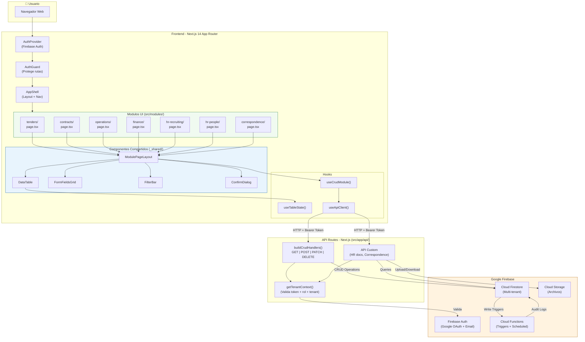
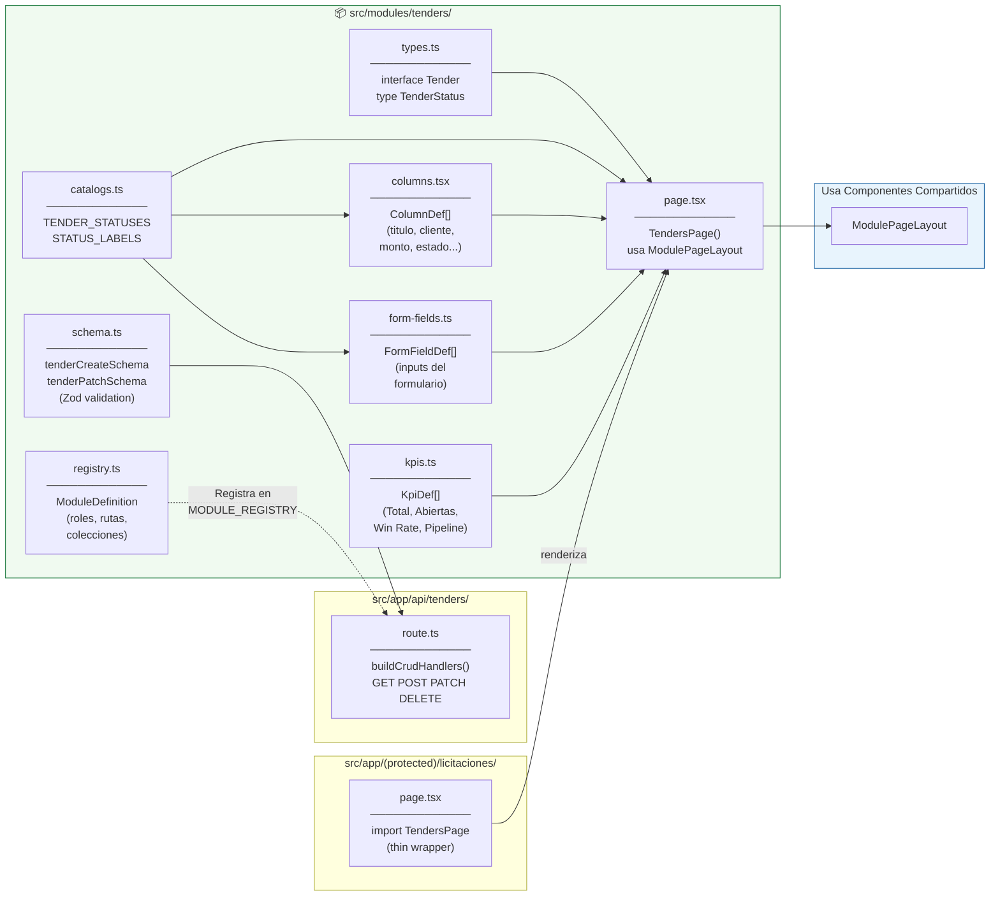
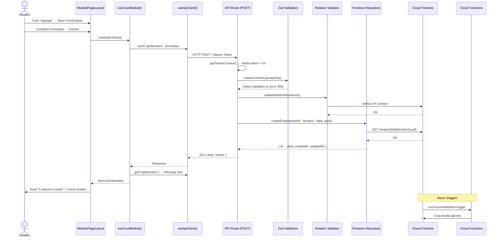
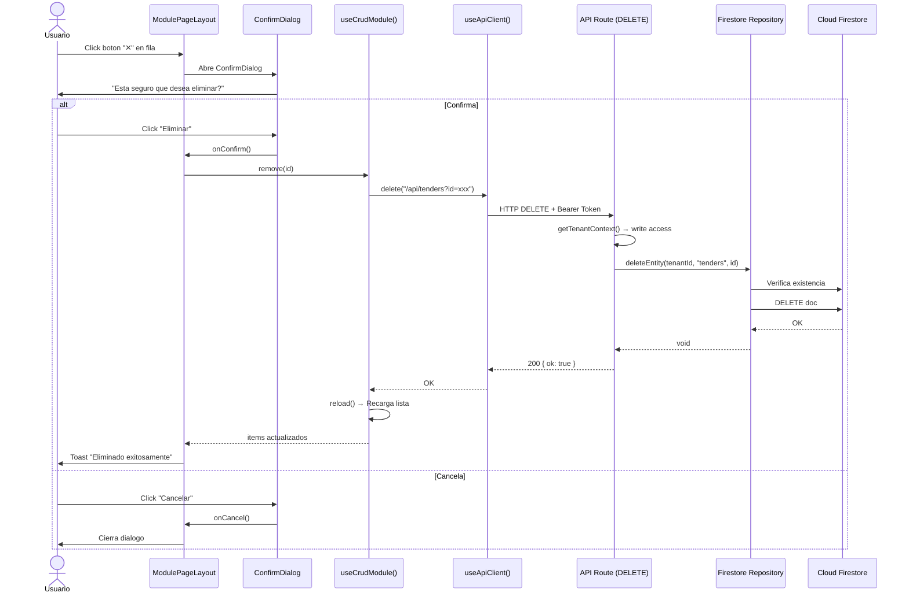
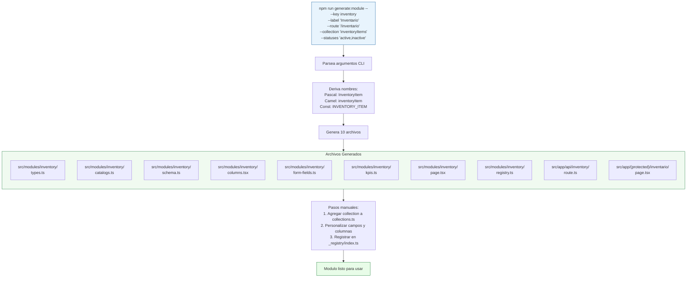
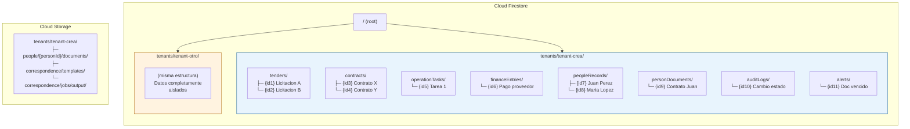
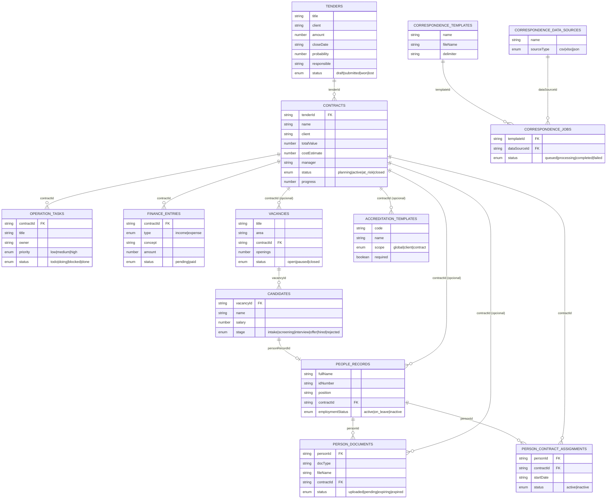
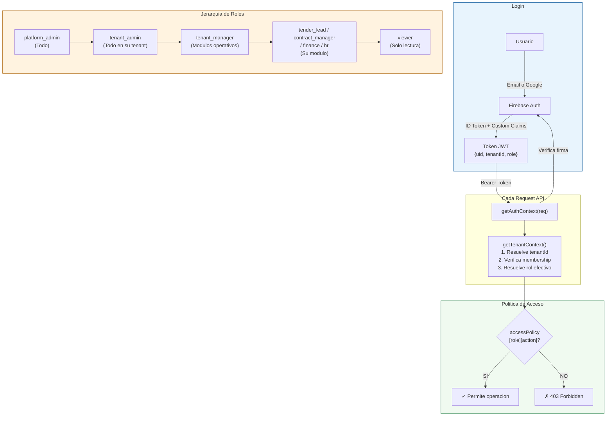
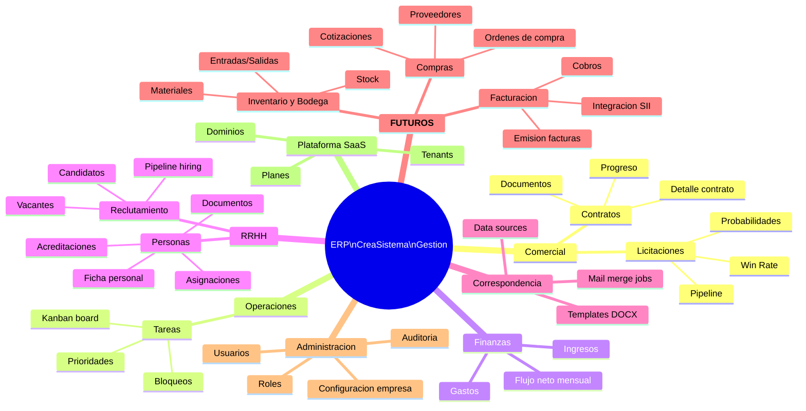

# Diagramas de Arquitectura - CreaSistemaGestion ERP

## 1. Flujo General del Sistema Modular



---

## 2. Anatomia de un Modulo ERP



---

## 3. Flujo CRUD Completo (Crear → Firebase → Respuesta)



---

## 4. Flujo DELETE (con Confirmacion)



---

## 5. Flujo del Generador de Modulos



---

## 6. Arquitectura Multi-Tenant (Firestore)



---

## 7. Mapa de Relaciones entre Entidades



---

## 8. Flujo de Autenticacion y Control de Acceso



---

## 9. Flujo de Componentes Compartidos

```
┌──────────────────────────────────────────────────────────────────────┐
│                    ModulePageLayout<T>                                │
│                                                                      │
│  ┌────────────────────────────────────────────────────────────────┐  │
│  │  ModulePage (titulo + descripcion)                             │  │
│  ├────────────────────────────────────────────────────────────────┤  │
│  │  Toast (mensajes de exito/error)                              │  │
│  ├────────────────────────────────────────────────────────────────┤  │
│  │  KpiGrid                                                      │  │
│  │  ┌──────────┐ ┌──────────┐ ┌──────────┐ ┌──────────────────┐ │  │
│  │  │ Total    │ │ Abiertas │ │ Win Rate │ │ Pipeline         │ │  │
│  │  │   12     │ │    5     │ │  71.4%   │ │ $45.000.000      │ │  │
│  │  └──────────┘ └──────────┘ └──────────┘ └──────────────────┘ │  │
│  ├────────────────────────────────────────────────────────────────┤  │
│  │  ModuleActionBar                  [Agregar licitacion]        │  │
│  ├────────────────────────────────────────────────────────────────┤  │
│  │  Panel "Listado"                                              │  │
│  │  ┌──────────────────────────────────────────────────────────┐ │  │
│  │  │  FilterBar                                               │ │  │
│  │  │  [🔍 Buscar por titulo, cliente...] [Estado ▼ Todos]     │ │  │
│  │  ├──────────────────────────────────────────────────────────┤ │  │
│  │  │  DataTable<Tender>                                       │ │  │
│  │  │  ┌────────┬─────────┬──────────┬────────┬──────┬──────┐ │ │  │
│  │  │  │Titulo ↑│ Cliente │  Monto   │ Cierre │Estado│  ✕   │ │ │  │
│  │  │  ├────────┼─────────┼──────────┼────────┼──────┼──────┤ │ │  │
│  │  │  │Obra A  │ Minera X│$12.000.0 │ 15-abr │[▼Won]│ [✕] │ │ │  │
│  │  │  │Obra B  │ Const Y │ $8.500.0 │ 22-may │[▼Sub]│ [✕] │ │ │  │
│  │  │  │Puente  │ MOP     │$25.000.0 │ 01-jun │[▼Dra]│ [✕] │ │ │  │
│  │  │  └────────┴─────────┴──────────┴────────┴──────┴──────┘ │ │  │
│  │  └──────────────────────────────────────────────────────────┘ │  │
│  └────────────────────────────────────────────────────────────────┘  │
│                                                                      │
│  ┌────────────────────────────────────────────────────────────────┐  │
│  │  FormDrawer (se abre al click "Agregar")                      │  │
│  │  ┌──────────────────────────────────────────────────────────┐ │  │
│  │  │  FormFieldsGrid                                          │ │  │
│  │  │  ┌─────────────────┐ ┌─────────────────┐                │ │  │
│  │  │  │ Nombre          │ │ Cliente          │                │ │  │
│  │  │  │ [____________] │ │ [____________]   │                │ │  │
│  │  │  ├─────────────────┤ ├─────────────────┤                │ │  │
│  │  │  │ Monto ($)       │ │ Cierre           │                │ │  │
│  │  │  │ [____0_______] │ │ [__/__/____]     │                │ │  │
│  │  │  ├─────────────────┤ ├─────────────────┤                │ │  │
│  │  │  │ Probabilidad %  │ │ Responsable      │                │ │  │
│  │  │  │ [____50______] │ │ [____________]   │                │ │  │
│  │  │  ├─────────────────┤                                     │ │  │
│  │  │  │ Estado          │                                     │ │  │
│  │  │  │ [▼ Borrador   ]│                                     │ │  │
│  │  │  └─────────────────┘                                     │ │  │
│  │  │  [Guardar]  [Cancelar]                                   │ │  │
│  │  └──────────────────────────────────────────────────────────┘ │  │
│  └────────────────────────────────────────────────────────────────┘  │
│                                                                      │
│  ┌────────────────────────────────────────────────────────────────┐  │
│  │  ConfirmDialog (se abre al click "✕")                         │  │
│  │  ┌──────────────────────────────────────────────────────────┐ │  │
│  │  │  Confirmar eliminacion                                   │ │  │
│  │  │  Esta seguro que desea eliminar "Obra A"?                │ │  │
│  │  │                           [Cancelar]  [Eliminar]         │ │  │
│  │  └──────────────────────────────────────────────────────────┘ │  │
│  └────────────────────────────────────────────────────────────────┘  │
└──────────────────────────────────────────────────────────────────────┘
```

---

## 10. Mapa de Modulos ERP Actuales y Futuros



---

## Como Ver Estos Diagramas

### Opcion 1: GitHub
Simplemente abre este archivo en GitHub — renderiza Mermaid automaticamente.

### Opcion 2: VS Code
Instala la extension "Markdown Preview Mermaid Support".

### Opcion 3: Online
Copia el codigo Mermaid en [mermaid.live](https://mermaid.live) para editar y exportar como PNG/SVG.

### Opcion 4: Los diagramas ASCII
Los diagramas en formato ASCII (secciones 9) se ven directamente en cualquier editor de texto.
